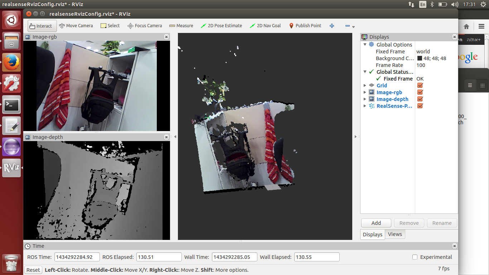

# Intel&reg; RealSense&trade; F200 Nodelet

Streaming data from the Intel&reg; RealSense&trade; F200 (IVCAM) camera

## Subscribed Topics
    None


## Publisehd Topics

Depth camera

    camera/depth/image_raw (sensor_msgs/Image)
        uint16 depths in mm.
    camera/depth/points (sensor_msgs/PointCloud2)
        Registered XYZRGB point cloud.
    camera/depth/uv (std_msgs/Float32MultiArray)
        UV mapping for depth image.
    camera/depth/camera_info
        Calibration data

Color camera

    camera/color/image_raw (sensor_msgs/Image)
        Color rectified image. RGB format.
    camera/color/camera_info
        Calibration data

## Parameters
    cHeight(int, default: 480) 
        Specify the color camera height resolution.
    cWidth(int, default: 640)
        Specify the color camera width resolution.
    dHeight(int, default: 360)
        Specify the depth camera height resolution.
    dWidth(int, default: 480)
        Specify the depth camera width resolution.
    pcScale(float, default: 1)
        Specify a scale divisor for the point cloud. 1 is mm and 1000 is meters.
    enableDepth(bool, default: 1) 
        Specify if to enable or not the depth camera. 1 is true. 0 is false.
    enableColor(bool, default: 1) 
        Specify if to enable or not the color camera. 1 is true. 0 is false.

## Services
    None


## Version
    2.0

## Known issues:
* First few frames may return error – “Failed to read image”. Just ignore those.
* You may get UVC_LASER_POWER error. If the camera is still working, then just please ignore it.
* Sometimes, the camera doesn’t initialize as expected and the nodelet is dying after few seconds. Simply restart the nodelet.
* Check Changelog.txt for more info


## Running the F200 nodelet
Simply type:

    roslaunch realsense realsense_f200_launch.launch

This will launch the camera nodelet. You will see the camera lights up.

A quick check will be to run the stock image viewer to see the color image:

    rosrun image_view image_view image:=/camera/color/image_raw

You can also open RVIZ and load the provided RVIZ configuration file: realsenseRvizConfiguration.rviz.


## Tech and dependencies 

* libivcam.so
* GLIBCXX_3.4.20
    Upgrade by:

        sudo add-apt-repository ppa:ubuntu-toolchain-r/test
        sudo apt-get update
        sudo apt-get upgrade
        sudo apt-get dist-upgrade

System:

* Linux 12.04+
* ROS Indigo
* F200 (IVCAM) camera

** The ROS integration has been tested on a 64bit machine with Linux 14.04.01 and ROS Indigo.

## Installation

#### Getting the camera to work on Linux
<b><i>Please make sure that you have a working camera and that the software stack is installed properly. This can be checked by connecting the camera (to a USB3 port) and running one of the provided samples.</b></i>

If this does not work, you should first fix this issue before continuing with the ROS integration.

In the package folder you will find ```f200_install``` folder.

Simply run 

    sh install.sh [path to install]. 

For example – 

    sh install.sh ~/ivcam

After installation is complete, in order to test :

* First build the provided sample in ```[installed folder]/ivcamsample/``` by running the build script: 

        sh [installed folder]/ivcamsample/build.sh

* Run 

        ./[installed folder]/ivcamsample/ivcam_sample 

The app just opens the camera and reads few frames. It does not have any GUI. The output should be something like that:

    $$$printParameters************************
    $$$2047.000000
    $$$1.485674
    $$$0.000000
    $$$0.131815
    $$$-0.055717
    $$$1.886967
    $$$-0.029558
    $$$0.000000
    $$$0.002917
    $$$-0.003724
    $$$1.420024
    $$$1.420011
    $$$0.999993
    $$$24.606842
    $$$0.000000
    $$$0.000000
    $$$-0.013931
    $$$printParameters ########################
    Failed to read image
    Failed to read image
    Error in Laser Power - UVC_GET_LEN
    ........................................................................
    ................................................................................
    ........................................


If you see the dots apearing on the screen, this means that the camera data is streaming. Just ignore any error messages that may apear before. 

#### Getting the nodelet to work

In the provided package, please run

    /realsense_dist/[ver]/install_realsense_ros.sh

<b> Please note that you need to to have ROS sourced since we are using the $ROS_DISTRO variable. </b>

This will copy the nodelets and different configuration files to the ```/opt/ros/indigo```.

You can find a sample nodelet in the folder under the “sample” folder. This shows the basic access to the camera streams.

